# Enterprise Refund AI Assistant

## Enterprise AI Knowledge Platform with Retrieval-Augmented Generation (RAG) on AWS

**Production-Ready Enterprise Generative AI Platform Using Amazon Bedrock, Amazon OpenSearch Serverless, Terraform, GitHub Actions, and Serverless Architecture**


---

### Enterprise AI Platform • Retrieval-Augmented Generation • Amazon Bedrock • OpenSearch Serverless • Terraform • GitHub Actions • AWS Lambda • Serverless Architecture

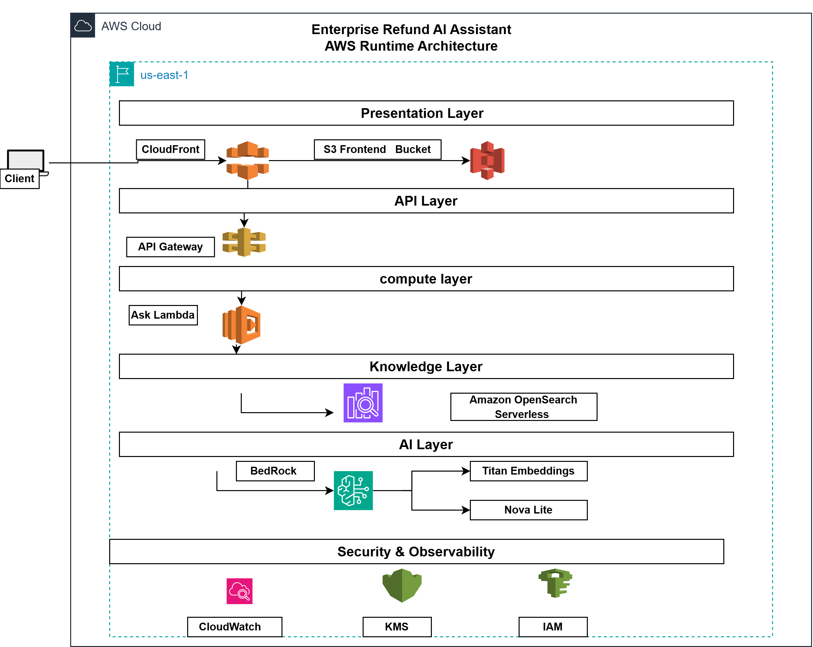

**Figure 0. Enterprise Refund AI Assistant – AWS Runtime Architecture**

An enterprise-grade, serverless AI knowledge platform that transforms enterprise documentation into trusted conversational intelligence using Retrieval-Augmented Generation (RAG). Built with Amazon Bedrock, Amazon OpenSearch Serverless, AWS Lambda, Amazon API Gateway, Amazon S3, Amazon DynamoDB, CloudFront, and Terraform, the solution demonstrates how organizations can build scalable, secure, and production-ready Generative AI applications grounded in approved enterprise knowledge.

## Key Achievements

- ✅ Enterprise-grade serverless AWS architecture
- ✅ Production-ready Retrieval-Augmented Generation (RAG) implementation
- ✅ Semantic vector search with Amazon OpenSearch Serverless
- ✅ Amazon Titan Text Embeddings V2 integration
- ✅ Amazon Nova Lite foundation model
- ✅ Automated PDF document ingestion pipeline
- ✅ Event-driven architecture using Amazon S3 and AWS Lambda
- ✅ Infrastructure as Code (IaC) using Terraform
- ✅ Secure GitHub Actions CI/CD with OpenID Connect (OIDC)
- ✅ Least-privilege IAM security architecture
- ✅ CloudWatch monitoring and observability
- ✅ Repeatable, automated enterprise deployments

## Solution Overview

| Component | Implementation |
|-----------|----------------|
| Cloud Platform | Amazon Web Services (AWS) |
| Architecture | Fully Serverless |
| AI Platform | Amazon Bedrock |
| Embedding Model | Titan Text Embeddings V2 |
| Foundation Model | Amazon Nova Lite |
| Vector Database | Amazon OpenSearch Serverless |
| Compute | AWS Lambda |
| API | Amazon API Gateway |
| Frontend | Amazon S3 + CloudFront |
| Infrastructure | Terraform |
| CI/CD | GitHub Actions |
| Monitoring | Amazon CloudWatch |

# Table of Contents

1. Executive Summary
2. Solution Architecture
3. Technology Stack
4. Project Structure
5. Enterprise Features
6. CI/CD Pipeline
7. Infrastructure Deployment
8. End-to-End Workflow
9. Application Demonstration
10. AWS Infrastructure
11. Monitoring & Observability
12. Security
13. Project Evolution
14. Engineering Challenges & Solutions
15. Lessons Learned
16. Future Enhancements
17. Demonstration
18. Conclusion
________________________________________


# 1. Executive Summary

## The Enterprise Knowledge Challenge

Modern enterprises generate and manage vast repositories of institutional knowledge, including corporate policies, operating procedures, compliance documentation, legal guidelines, and customer service standards. Although this information is fundamental to daily business operations, employees often spend significant time searching fragmented information sources, resulting in reduced productivity, inconsistent decision-making, increased operational risk, and higher support costs.

As organizations accelerate the adoption of Generative AI, they face a critical challenge: how to deliver intelligent, conversational experiences without compromising the accuracy, governance, and trustworthiness of enterprise information. Public AI models alone cannot reliably answer organization-specific questions because they lack access to current internal knowledge and may generate responses that are inaccurate or unsupported by company policy.

---

## The Enterprise Solution

The **Enterprise Refund AI Assistant** demonstrates a production-style architectural pattern that transforms static enterprise documentation into an intelligent, secure, and conversational knowledge platform.

Rather than relying solely on a foundation model's pre-trained knowledge, the solution applies a **Retrieval-Augmented Generation (RAG)** approach that retrieves relevant enterprise content in real time before generating a response. This ensures that responses are grounded in authoritative organizational documentation, significantly reducing the risk of AI hallucinations while improving consistency, traceability, and confidence in business decisions.

---

## Business Value

From a business perspective, this architectural approach delivers measurable value across multiple dimensions:

- **Improve employee productivity** by reducing the time required to locate critical information.
- **Enhance customer service** through faster and more consistent responses.
- **Strengthen governance** by grounding responses in approved enterprise documentation.
- **Reduce operational risk** associated with inconsistent policy interpretation.
- **Provide a scalable and cost-efficient foundation** that automatically adapts to changing business demand while minimizing operational overhead.

---

## Enterprise Applicability

Although this implementation demonstrates an enterprise refund policy use case, the underlying architectural pattern is broadly applicable across virtually every knowledge-intensive business function.

Potential enterprise use cases include:

- Human Resources
- Legal Services
- Regulatory Compliance
- Healthcare Knowledge Management
- Financial Services
- IT Operations
- Customer Support
- Enterprise Knowledge Management

The same architectural blueprint enables organizations to modernize how employees and customers interact with trusted institutional knowledge through secure, AI-powered conversational experiences.

---

## Executive Conclusion

This project demonstrates more than the implementation of a Generative AI application. It presents a scalable enterprise architecture that combines **responsible AI**, **cloud-native engineering**, and **modern software delivery practices** to help organizations:

- Improve operational efficiency
- Reduce business risk
- Accelerate decision-making
- Increase workforce productivity
- Establish a sustainable foundation for enterprise AI transformation

By combining business objectives with modern cloud architecture, the Enterprise Refund AI Assistant illustrates how organizations can responsibly adopt Generative AI to transform enterprise knowledge into a strategic business asset.

> **Executive Takeaway**
>
> The Enterprise Refund AI Assistant demonstrates how Retrieval-Augmented Generation (RAG) can transform enterprise knowledge into a trusted conversational platform that improves productivity, strengthens governance, reduces operational risk, and establishes a scalable foundation for enterprise AI adoption.
---

## Key Capabilities

- Enterprise Retrieval-Augmented Generation (RAG)
- Amazon Bedrock integration using Amazon Nova Lite
- Titan Text Embeddings V2 for semantic vector generation
- Amazon OpenSearch Serverless vector search
- Automated document ingestion pipeline
- PDF document processing and chunking
- Event-driven architecture using Amazon S3 notifications
- Fully serverless backend with AWS Lambda
- Infrastructure as Code using Terraform
- Secure GitHub Actions CI/CD with OIDC authentication
- CloudFront-hosted responsive web application
- End-to-end enterprise deployment on AWS

---

## Business Problem

Large organizations rely on extensive collections of internal documentation, including refund policies, HR procedures, compliance manuals, and operational guidelines. Employees and customers often spend significant time searching for relevant information, while traditional chatbots frequently generate responses that are not grounded in official documentation.

This leads to:

- Inconsistent customer responses
- Increased support costs
- Long information retrieval times
- Risk of hallucinated AI responses
- Difficulty maintaining knowledge consistency across the organization

The objective of this project is to demonstrate how enterprise AI systems can use Retrieval-Augmented Generation (RAG) to provide accurate, context-aware, and document-grounded responses while maintaining a scalable, serverless AWS architecture.

---

## Solution Overview

The Enterprise Refund AI Assistant implements a complete Retrieval-Augmented Generation workflow.

During document ingestion, enterprise policy documents are uploaded to Amazon S3. An event notification triggers the ingestion Lambda function, which extracts document text, performs intelligent chunking, generates semantic embeddings using Amazon Bedrock Titan Text Embeddings V2, and stores both document metadata and vector representations in Amazon OpenSearch Serverless.

During user interaction, customer questions are submitted through a CloudFront-hosted web application. The backend Lambda generates an embedding for the incoming question, performs semantic similarity search against OpenSearch Serverless, retrieves the most relevant document chunks, augments the prompt with enterprise context, and submits the enriched prompt to Amazon Bedrock (Amazon Nova Lite). The resulting answer is therefore grounded in enterprise documentation rather than relying solely on the language model's pretrained knowledge.

# 2. Solution Architecture

The Enterprise Refund AI Assistant is designed as a cloud-native, event-driven, Retrieval-Augmented Generation (RAG) platform built entirely on managed AWS services. The architecture separates the system into three logical views, each illustrating a different aspect of the solution.

---

## 1. Logical RAG Workflow

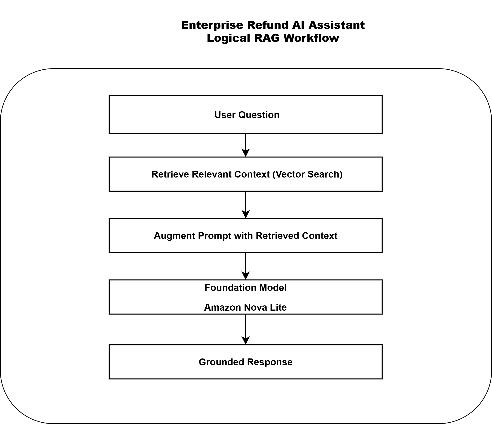

**Figure 1. Logical Retrieval-Augmented Generation Workflow**

This diagram illustrates the conceptual Retrieval-Augmented Generation (RAG) workflow independent of any cloud provider.

The workflow begins when a user submits a natural language question. Instead of sending the prompt directly to a Large Language Model, the application first retrieves semantically relevant information from the enterprise knowledge base using vector similarity search.

The retrieved document context is then combined with the user's original question to create an augmented prompt. This enriched prompt is submitted to Amazon Nova Lite through Amazon Bedrock, enabling the model to generate responses grounded in enterprise documentation rather than relying solely on pretrained knowledge.

This architecture significantly reduces hallucinations while improving answer accuracy, consistency, and explainability.

---

## 2. AWS Runtime Architecture


**Figure 2. Enterprise Refund AI Assistant – AWS Runtime Architecture**

The production implementation is fully serverless and leverages managed AWS services to provide scalability, operational simplicity, and cost efficiency.

The runtime architecture is organized into several logical layers:

### Presentation Layer

The web application is hosted on Amazon S3 and globally distributed using Amazon CloudFront. CloudFront provides HTTPS delivery, low-latency access, and edge caching for static frontend assets.

### API Layer

User requests are routed through Amazon API Gateway, which exposes secure REST endpoints consumed by the frontend application.

### Compute Layer

AWS Lambda serves as the RAG orchestrator. The Ask Lambda function coordinates the complete inference workflow by:

- Receiving user questions
- Generating query embeddings
- Executing vector similarity searches
- Constructing the augmented prompt
- Invoking Amazon Bedrock
- Returning grounded responses

Because Lambda is fully managed, the application automatically scales based on incoming request volume without requiring server management.

### Knowledge Layer

Amazon OpenSearch Serverless acts as the enterprise vector database.

Each document chunk generated during ingestion is stored alongside its corresponding embedding, enabling semantic retrieval through approximate nearest-neighbor vector search.

### AI Layer

Amazon Bedrock provides access to fully managed foundation models.

The application uses:

- Titan Text Embeddings V2 for generating 1024-dimensional vector embeddings during document ingestion and query processing.
- Amazon Nova Lite for grounded natural language response generation using the augmented prompt.

### Database Layer

Amazon DynamoDB stores conversational session history, allowing the assistant to preserve context across multiple interactions while maintaining a fully serverless architecture.

### Security & Observability

Operational visibility and security are provided through:

- AWS Identity and Access Management (IAM) for least-privilege access control
- AWS Key Management Service (KMS) for encryption
- Amazon CloudWatch for centralized logging, monitoring, and operational diagnostics

---

## 3. Document Ingestion Pipeline

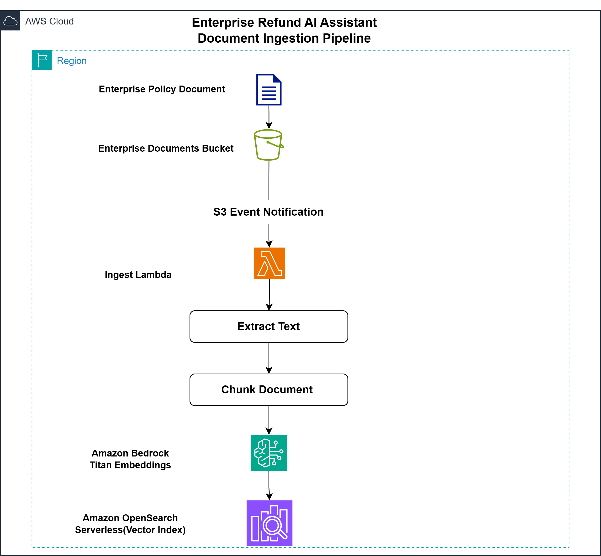

**Figure 3. Enterprise Refund AI Assistant- Event-Driven Document Ingestion Pipeline**

The ingestion pipeline transforms enterprise documents into searchable semantic knowledge without requiring manual intervention.

The workflow consists of the following stages:

### Step 1 — Document Upload

Enterprise policy documents are uploaded to an Amazon S3 document repository.

### Step 2 — Event Notification

Amazon S3 Event Notifications automatically trigger the ingestion Lambda whenever a supported document is uploaded.

### Step 3 — Text Extraction

The ingestion Lambda extracts raw textual content from the uploaded document while preserving logical document structure.

### Step 4 — Intelligent Chunking

Extracted text is segmented into overlapping chunks using a configurable chunking strategy.

For this implementation:

- Chunk size: 1,000 characters
- Overlap: 200 characters

This approach improves semantic retrieval by preserving contextual continuity across adjacent chunks.

### Step 5 — Embedding Generation

Each document chunk is converted into a 1024-dimensional vector representation using Amazon Bedrock Titan Text Embeddings V2.

### Step 6 — Vector Indexing

The generated embeddings, along with associated metadata and document content, are stored in Amazon OpenSearch Serverless.

Once indexed, the knowledge base becomes immediately available for semantic retrieval by the Ask Lambda during user interactions.

---

### Architecture Design Principles

Several architectural principles guided the implementation of this solution:

- **Serverless First** – All compute components use fully managed AWS services, eliminating infrastructure management.
- **Event-Driven Processing** – Document ingestion is automatically triggered through Amazon S3 events.
- **Infrastructure as Code** – All cloud resources are provisioned using Terraform, ensuring repeatable and version-controlled deployments.
- **Security by Default** – IAM least-privilege policies, encryption through AWS KMS, and secure GitHub OIDC authentication are used throughout the deployment pipeline.
- **Modular Design** – The solution separates presentation, compute, knowledge, AI, and data layers to improve maintainability and extensibility.
- **Scalable Retrieval** – OpenSearch Serverless enables efficient vector search while Amazon Bedrock provides fully managed foundation model access without managing inference infrastructure.


# 3. Technology Stack

The Enterprise Refund AI Assistant is built using a fully serverless, cloud-native architecture on AWS. The solution combines Retrieval-Augmented Generation (RAG), event-driven processing, Infrastructure as Code (IaC), and enterprise DevOps practices to demonstrate a production-style Generative AI platform.

Rather than serving as a simple chatbot, the platform automates the complete lifecycle of enterprise knowledge—from document ingestion and semantic indexing to grounded response generation and operational monitoring.

---

## Artificial Intelligence

| Service | Purpose |
|---------|---------|
| Amazon Bedrock | Managed Generative AI platform |
| Amazon Nova Lite | Response generation |
| Titan Text Embeddings V2 | 1024-dimensional vector embedding generation |
| Amazon OpenSearch Serverless | Vector similarity search |

---

## Compute Layer

| Service | Purpose |
|---------|---------|
| AWS Lambda (Ask) | RAG orchestration and inference |
| AWS Lambda (Ingest) | Document processing and indexing |
| AWS Lambda (Admin) | Administrative operations and system management |
| Amazon API Gateway | REST API endpoints |

---

## Storage Layer

| Service | Purpose |
|---------|---------|
| Amazon S3 | Static frontend hosting and document repository |
| Amazon DynamoDB (Conversation) | Chat session persistence |
| Amazon DynamoDB (Chunk Metadata) | Document chunk metadata |
| Amazon DynamoDB (Analytics) | Operational analytics |
| Amazon OpenSearch Serverless | Enterprise vector index |

---

## Networking

| Service | Purpose |
|---------|---------|
| Amazon CloudFront | Global CDN |
| Amazon API Gateway | Public API endpoint |

---

## Security

| Service | Purpose |
|---------|---------|
| AWS IAM | Least-privilege access control |
| AWS KMS | Encryption |
| GitHub OIDC | Passwordless CI/CD authentication |

---

## Monitoring & Operations

| Service | Purpose |
|---------|---------|
| Amazon CloudWatch Logs | Lambda logging |
| CloudWatch Dashboard | Operational visibility |
| CloudWatch Alarms | Health monitoring |
| Amazon SNS | Operational notifications |

---

## DevOps

| Technology | Purpose |
|-----------|---------|
| Terraform | Infrastructure as Code |
| GitHub Actions | CI/CD |
| Git | Source control |
| OIDC Federation | Secure AWS deployments |


________________________________________
## Programming Languages
•	Python 3.12 
•	JavaScript 
•	HTML5 
•	CSS3 
•	Terraform (HCL) 
________________________________________
## Python Libraries
•	boto3 
•	opensearch-py 
•	requests-aws4auth 
•	pypdf 
•	requests 
________________________________________
## Enterprise Capabilities
The platform implements several enterprise-grade capabilities beyond standard Retrieval-Augmented Generation.
•	Semantic document retrieval 
•	Automated vector indexing 
•	Event-driven document ingestion 
•	Serverless AI inference 
•	Session-aware conversations 
•	Operational analytics 
•	Cloud-native monitoring 
•	Automated infrastructure deployment 
•	Secure CI/CD using OIDC 
•	Infrastructure bootstrap automation 
________________________________________
## Design Principles
The architecture follows several engineering principles that guided the implementation.
Serverless First
Every compute workload is implemented using fully managed AWS services, minimizing operational overhead while providing automatic scalability.
________________________________________
## Event-Driven Architecture
The platform reacts automatically to document uploads through Amazon S3 Event Notifications, eliminating manual ingestion processes.
________________________________________
## Retrieval-Augmented Generation
Enterprise knowledge is retrieved dynamically from OpenSearch Serverless before invoking the foundation model, ensuring responses remain grounded in authoritative documentation.
________________________________________
## Infrastructure as Code
Every AWS resource is provisioned and managed using Terraform, enabling reproducible deployments and version-controlled infrastructure changes.
________________________________________
## Security by Design
Security is integrated throughout the platform using IAM least-privilege policies, AWS KMS encryption, GitHub OIDC authentication, and managed AWS services.
________________________________________
## Operational Excellence
CloudWatch dashboards, alarms, analytics tables, and SNS notifications provide visibility into system health and operational events.
________________________________________


# 4. Project Structure

Unlike a simple proof-of-concept, the repository is organized into independent infrastructure, application, automation, and operational components.

```text
enterprise-refund-ai/
│
├── .github/
│   └── workflows/
│       └── terraform.yml
│
├── backend/
│   ├── src/
│   │   ├── admin/
│   │   │   └── lambda_function.py
│   │   ├── ask/
│   │   │   └── lambda_function.py
│   │   └── ingest/
│   │       ├── lambda_function.py
│   │       └── requirements.txt
│   │
│   ├── frontend/
│   └── scripts/
│       ├── bootstrap_opensearch_index.py
│       └── bootstrap_requirements.txt
│
├── terraform/
│   ├── apigateway.tf
│   ├── backend.tf
│   ├── cloudwatch.tf
│   ├── dynamodb.tf
│   ├── iam.tf
│   ├── lambda_admin.tf
│   ├── lambda_ask.tf
│   ├── lambda_ingest.tf
│   ├── opensearch.tf
│   ├── providers.tf
│   ├── variables.tf
│   └── versions.tf
│
├── architecture/
├── screenshots/
└── README.md
```

---

### Repository Organization

The repository is organized into four major solution domains.

## Backend Services

The backend contains three independent AWS Lambda functions, each with a clearly defined responsibility.

### Ask Lambda

- RAG orchestration
- Vector search
- Prompt augmentation
- Amazon Bedrock invocation
- Conversation management

### Ingest Lambda

- Document ingestion
- PDF text extraction
- Intelligent chunking
- Titan embedding generation
- OpenSearch indexing

### Admin Lambda

- Administrative APIs
- Platform management
- Operational utilities

---

## Infrastructure

Terraform provisions all AWS resources, including networking, storage, compute, AI services, monitoring, security, and deployment automation.

---

## Automation

The .github/workflows directory contains an enterprise GitHub Actions pipeline that validates Terraform, deploys infrastructure using OIDC authentication, bootstraps OpenSearch indexes, and publishes frontend assets.

---

## Bootstrap & Utilities

The scripts directory contains operational utilities used during deployment, including OpenSearch index bootstrapping and deployment dependencies.

# 5. Enterprise Features & Capabilities

The Enterprise Refund AI Assistant was designed as a production-style Retrieval-Augmented Generation (RAG) platform rather than a standalone chatbot. The platform combines managed AWS services, event-driven processing, semantic search, and Infrastructure as Code to deliver an enterprise-grade AI solution.

## Core AI Capabilities

### Retrieval-Augmented Generation (RAG)

The application retrieves semantically relevant document context from Amazon OpenSearch Serverless before invoking the foundation model. This retrieval step grounds every response in enterprise documentation, reducing hallucinations and improving answer accuracy.

---

### Semantic Vector Search

Instead of relying on traditional keyword matching, the platform performs semantic similarity searches using 1024-dimensional vector embeddings generated by Amazon Bedrock Titan Text Embeddings V2.

This enables the assistant to retrieve context based on meaning rather than exact wording.

---

### Grounded Response Generation

Retrieved document chunks are injected into the user prompt before sending the request to Amazon Nova Lite through Amazon Bedrock. Responses are therefore generated using enterprise knowledge rather than only the model's pretrained information.

---

### Automated Knowledge Base

Uploading a new policy document automatically updates the enterprise knowledge base without requiring manual indexing or application redeployment.

The ingestion pipeline performs:

- Document extraction
- Intelligent chunking
- Embedding generation
- Vector indexing

This allows new enterprise knowledge to become searchable within minutes.

---

### Conversation Management

The assistant maintains conversational context using Amazon DynamoDB, enabling follow-up questions while preserving session history.

---

### Fully Serverless Architecture

Every compute component runs on managed AWS services.

Benefits include:

- Automatic scaling
- No server management
- Reduced operational overhead
- Pay-per-use pricing model

---

### Enterprise Observability

Operational visibility is provided through:

- Amazon CloudWatch Logs
- CloudWatch Dashboards
- CloudWatch Alarms
- Amazon SNS Notifications

These services enable proactive monitoring of infrastructure health and application behavior.

---

### Infrastructure as Code

All AWS resources are provisioned using Terraform, ensuring:

- Repeatable deployments
- Version-controlled infrastructure
- Environment consistency
- Simplified disaster recovery

---

### Secure CI/CD

Infrastructure deployments are automated through GitHub Actions using OpenID Connect (OIDC), eliminating long-lived AWS credentials and aligning with AWS security best practices.

---

# 6. CI/CD Pipeline

## Continuous Integration & Continuous Deployment (CI/CD)

Infrastructure and application deployment are fully automated using GitHub Actions and Terraform.

The deployment pipeline follows an enterprise GitOps approach in which all infrastructure changes are version-controlled, peer-reviewed, and deployed through automated workflows.

---

## CI/CD Workflow

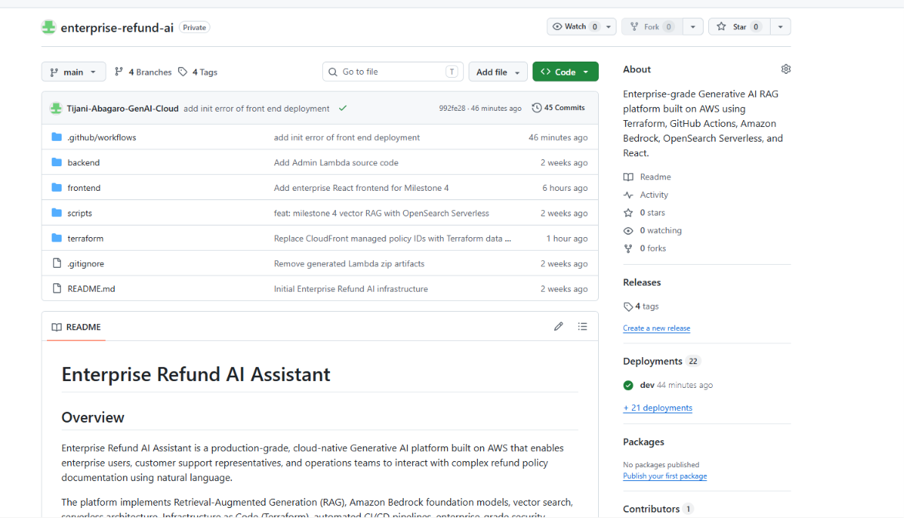

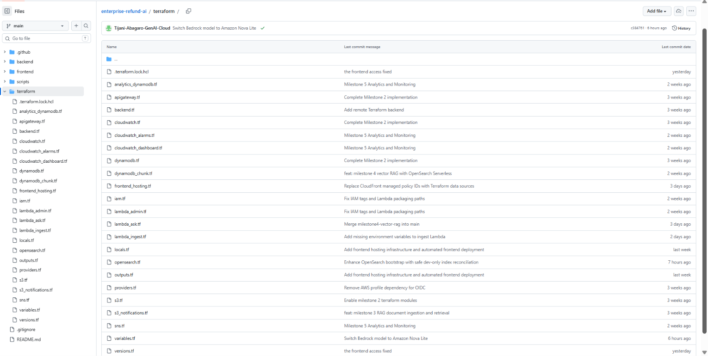

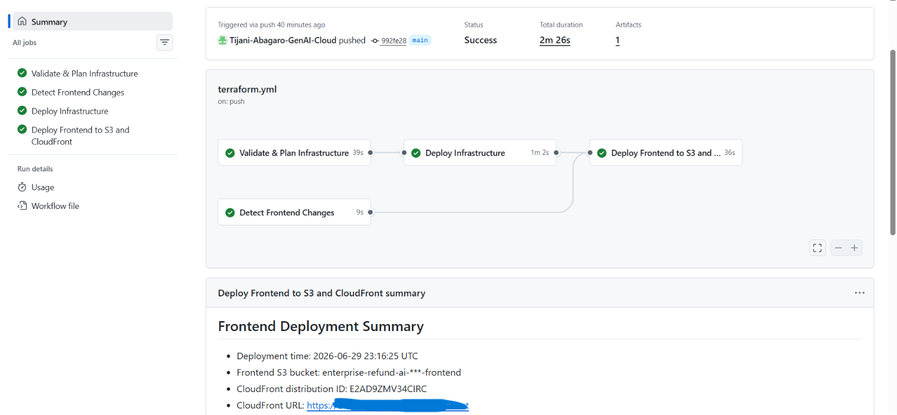

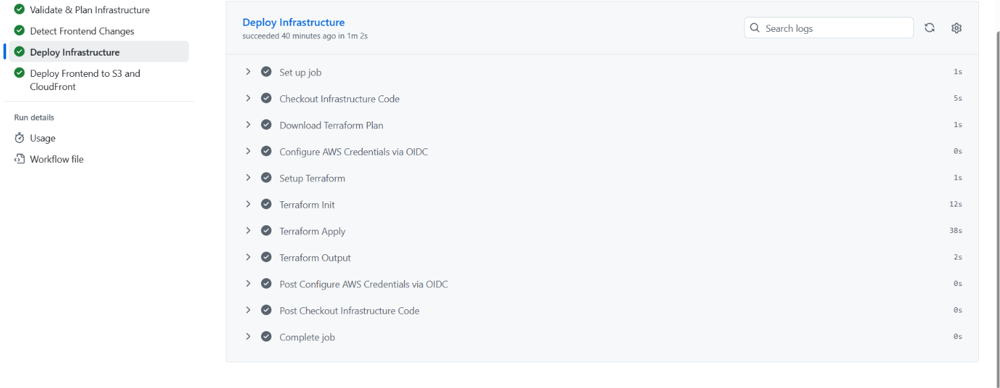

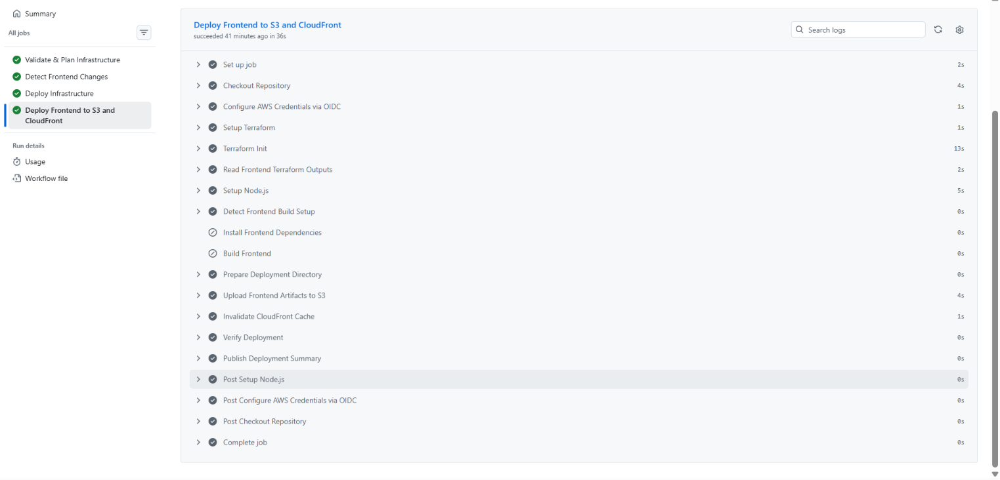

**Figure 4. Enterprise GitHub Actions CI/CD Pipeline**

The deployment pipeline consists of four major stages.

### 1. Validate & Plan Infrastructure

- Terraform formatting validation
- Terraform initialization
- Terraform validation
- Terraform plan generation

This stage verifies infrastructure changes before deployment.

---

### 2. Detect Frontend Changes

The workflow determines whether frontend assets have changed.

If no frontend files were modified, frontend deployment is skipped, reducing unnecessary CloudFront invalidations and deployment time.

---

### 3. Deploy Infrastructure

Terraform provisions or updates AWS infrastructure, including:

- Lambda Functions
- IAM Roles
- API Gateway
- Amazon S3
- OpenSearch Serverless
- DynamoDB
- CloudWatch Resources

During deployment, the OpenSearch bootstrap process validates and initializes the vector index required for semantic retrieval.

---

### 4. Deploy Frontend

When frontend assets change, the pipeline automatically:

- Uploads static assets to Amazon S3
- Invalidates CloudFront cache
- Publishes the latest web application

This ensures users always receive the most recent frontend version.

---

### Secure Authentication

The deployment pipeline uses GitHub OpenID Connect (OIDC) federation to authenticate directly with AWS.

This approach eliminates static AWS credentials from GitHub Secrets and follows AWS security best practices for CI/CD.

---

### Deployment Benefits

- Automated infrastructure provisioning
- Secure credentialless authentication
- Consistent deployments
- Reduced manual intervention
- Version-controlled infrastructure
- Enterprise GitOps workflow

---

# 7. Infrastructure Deployment

The entire platform is provisioned using Terraform and deployed through a single automated workflow.

## Infrastructure components include:

### Compute

- AWS Lambda (Ask)

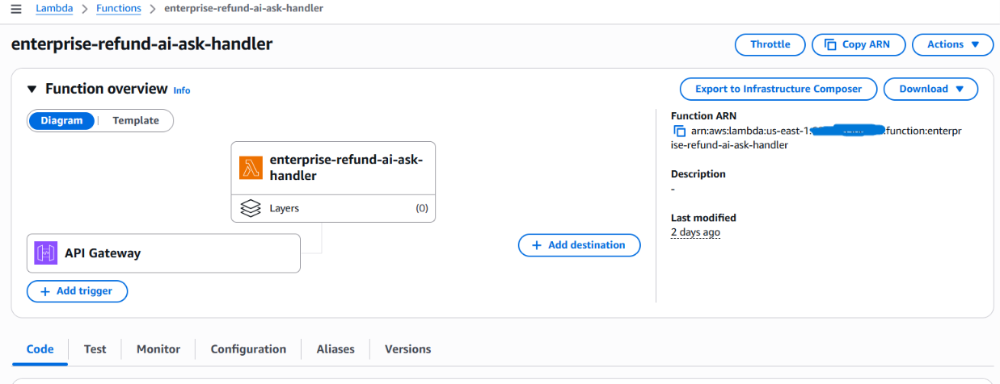

**Figure 7. Ask Lambda Function**

- AWS Lambda (Ingest)

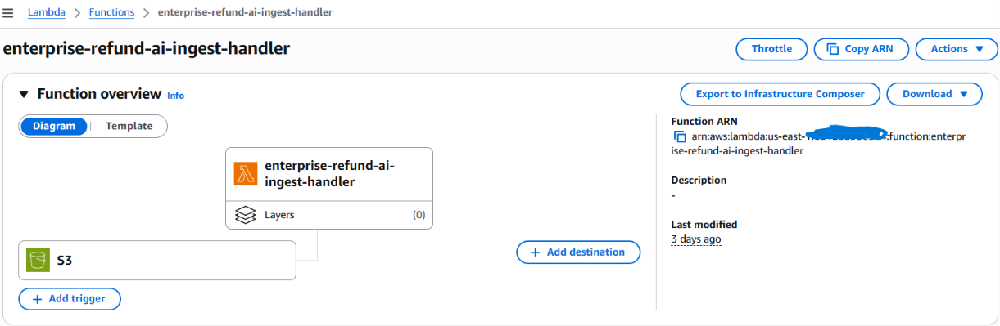

**Figure 8. Ingest Lambda Function**

- AWS Lambda (Admin)

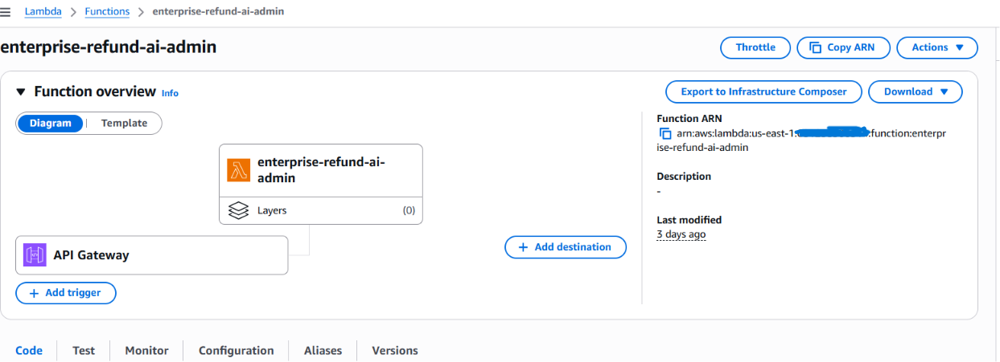

**Figure 9. Admin Lambda Function**

---

### AI Services

- Amazon Bedrock

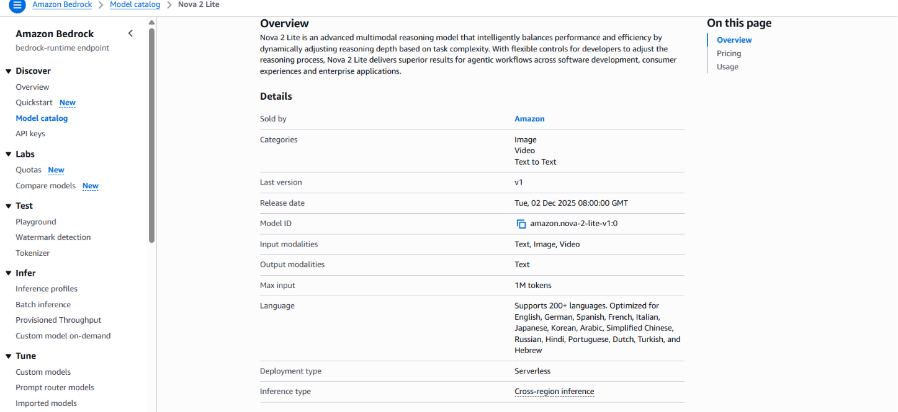

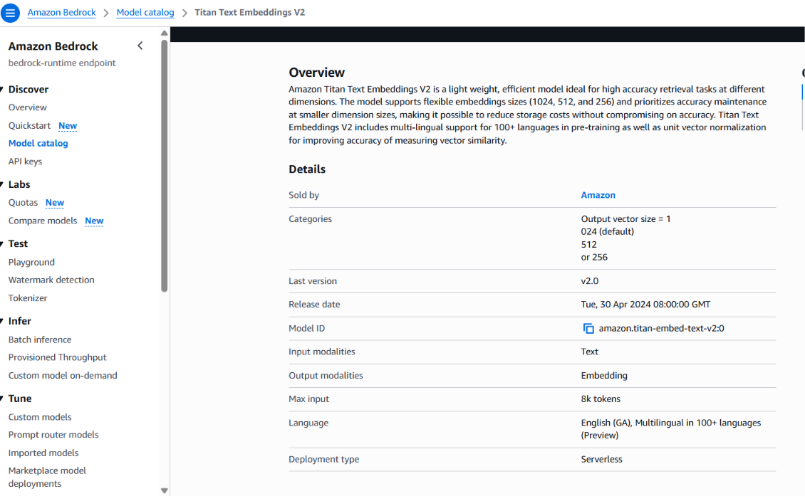

**Figure 5. Amazon Bedrock Models**

- Amazon Nova Lite
- Titan Text Embeddings V2

---

### Knowledge Layer

- Amazon OpenSearch Serverless
- Vector Index Bootstrap
- Semantic Search Configuration

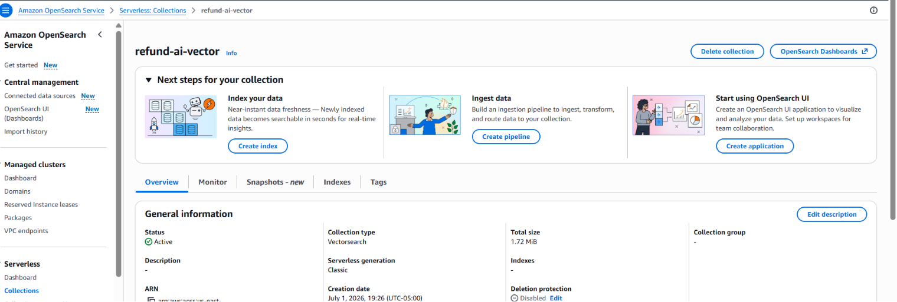

**Figure 6. Amazon OpenSearch Serverless Collection**

---

### Storage

- Amazon S3
- Amazon DynamoDB
  - Conversation Table
  - Chunk Metadata Table
  - Analytics Table

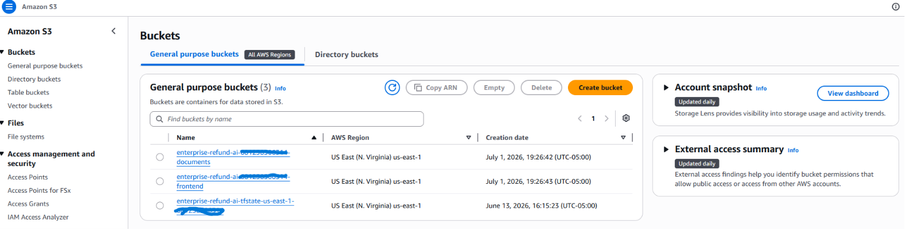

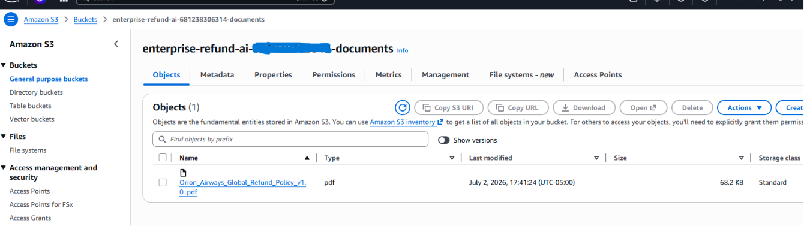

**Figure 12. Amazon S3 Buckets**

---

### API Layer

- Amazon API Gateway

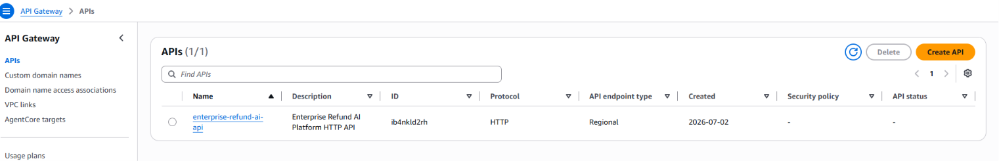

**Figure 10. Amazon API Gateway**

---

### Content Delivery

- Amazon CloudFront

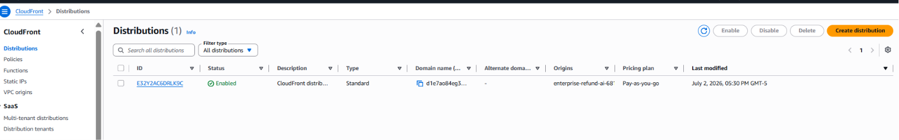

**Figure 11. Amazon CloudFront Distribution**

---

### Monitoring

- CloudWatch Logs
- CloudWatch Dashboard
- CloudWatch Alarms
- SNS Notifications

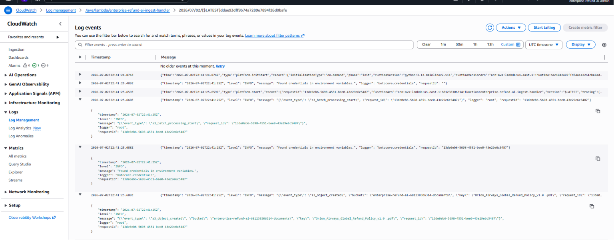

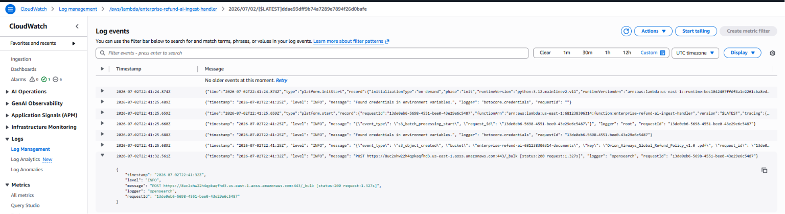

.png)

.png)

- **Figure 12. Amazon CloudFront Distribution**

---

### Security

- IAM Roles
- IAM Policies
- AWS KMS Encryption
- GitHub OIDC Authentication

- 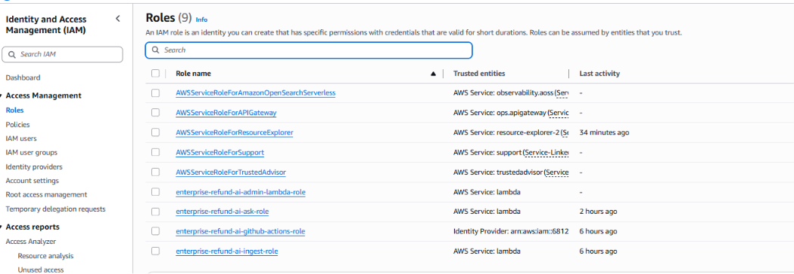

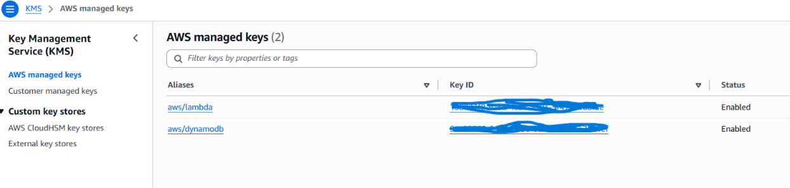

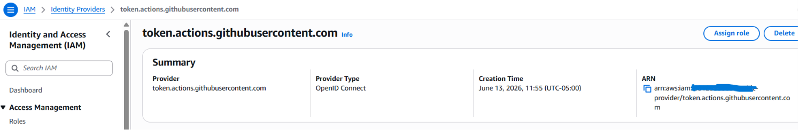

**Figure 13. Amazon CloudFront Distribution**

---

### Deployment Highlights

The deployment process includes several automated validation and bootstrap tasks:

- OpenSearch index creation
- Vector index validation
- Infrastructure dependency management
- IAM permission configuration
- Lambda package deployment
- Static website publication

These tasks ensure the environment is fully operational immediately after deployment.

---

# 8. End-to-End Workflows

The Enterprise Refund AI Assistant implements two independent workflows that operate together to provide an intelligent document-grounded conversational experience.

---

## Workflow 1 — Document Ingestion Pipeline


**Figure 5. Document Ingestion Workflow**

This workflow illustrates how enterprise PDF documents uploaded to Amazon S3 automatically trigger the ingestion pipeline. The Ingest Lambda extracts text, performs chunking, generates semantic embeddings using Amazon Bedrock Titan Text Embeddings V2, and indexes the resulting vectors into Amazon OpenSearch Serverless.

The document ingestion workflow automatically transforms enterprise policy documents into searchable vector representations.

### Step 1 — Upload

An enterprise policy document is uploaded to the Amazon S3 document repository.

↓

### Step 2 — Event Notification

Amazon S3 generates an ObjectCreated event.

↓

### Step 3 — Lambda Invocation

The Ingest Lambda function is triggered automatically.

↓

### Step 4 — Text Extraction

The Lambda extracts textual content from the uploaded document.

↓

### Step 5 — Intelligent Chunking

The extracted content is divided into overlapping chunks.

Configuration:

- Chunk Size: 1,000 characters
- Chunk Overlap: 200 characters

↓

### Step 6 — Embedding Generation

Each chunk is converted into a semantic vector using Amazon Bedrock Titan Text Embeddings V2.

↓

### Step 7 — Vector Indexing

Embeddings, metadata, and document content are stored in Amazon OpenSearch Serverless.

The knowledge base is now immediately available for semantic retrieval.

---

## Workflow 2 — User Question Processing

Figure 6. Runtime RAG Workflow


**Figure 3. Retrieval-Augmented Generation (RAG) Workflow**

This workflow illustrates how a user question is transformed into a semantic embedding, matched against the enterprise vector knowledge base, augmented with retrieved context, and submitted to Amazon Nova Lite to generate a grounded response.

When a user submits a question, the platform performs the following sequence:

### 1.

User submits a natural language question.

↓

### 2.

Ask Lambda receives the request.

↓

### 3.

The question is embedded using Titan Text Embeddings V2.

↓

### 4.

A semantic vector search retrieves the most relevant document chunks from Amazon OpenSearch Serverless.

↓

### 5.

The retrieved context is merged with the original question.

↓

### 6.

The augmented prompt is submitted to Amazon Nova Lite through Amazon Bedrock.

↓

### 7.

Amazon Nova Lite generates a grounded response using the retrieved enterprise documentation.

↓

### 8.

The response is returned to the frontend and conversation history is stored in Amazon DynamoDB.

---

## Why This Architecture?

This dual-workflow design separates knowledge ingestion from knowledge retrieval, allowing enterprise documents to evolve independently of the application. New documents become searchable through the ingestion pipeline without requiring changes to the runtime application or redeployment of the AI assistant.

# 9. Application Demonstration

The Enterprise Refund AI Assistant provides a web-based conversational interface that enables users to interact with enterprise knowledge using natural language.

Unlike traditional keyword search applications, the assistant performs semantic retrieval against enterprise documentation before generating responses. This Retrieval-Augmented Generation (RAG) approach ensures that answers are grounded in organizational policies rather than relying solely on the foundation model's pretrained knowledge.

---

## User Experience

The application is delivered as a static web application hosted on Amazon S3 and distributed globally through Amazon CloudFront.

Users interact with the assistant through a clean, responsive chat interface without requiring any software installation.

Figure 7. Enterprise Refund AI Assistant Web Interface

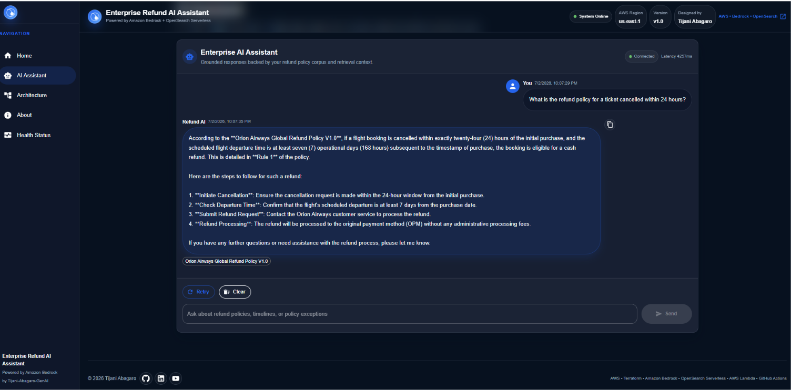

**Figure 13. Enterprise Refund AI Assistant**

---

## Example Conversation

### User Question

"What is the refund policy for tickets cancelled within 24 hours?"

### Runtime Workflow

The platform performs the following sequence:

1. Receives the user question through the web interface.
2. Sends the request to Amazon API Gateway.
3. Invokes the Ask Lambda function.
4. Generates a semantic embedding using Amazon Bedrock Titan Text Embeddings V2.
5. Performs a vector similarity search against Amazon OpenSearch Serverless.
6. Retrieves the most relevant policy document chunks.
7. Augments the original prompt with retrieved enterprise context.
8. Invokes Amazon Nova Lite through Amazon Bedrock.
9. Returns a grounded response to the frontend.
10. Stores the conversation history in Amazon DynamoDB.

________________________________________

# Retrieval-Augmented Generation

The application does not answer questions directly from the language model. Instead, every response follows the RAG workflow:

### **The RAG Workflow**
*  **User Question**
*  **Generate Query Embedding**
*  **Vector Search** *(OpenSearch Serverless)*
*  **Retrieve Relevant Policy Chunks**
*  **Prompt Augmentation**
*  **Amazon Nova Lite**
*  **Grounded Response**

---

### Grounded Response
> This architecture significantly improves response quality by grounding generated answers in enterprise documentation.
---

## Demonstrated Capabilities

The deployed application demonstrates:

- Natural language question answering
- Retrieval-Augmented Generation (RAG)
- Semantic vector search
- Grounded response generation
- Context-aware conversations
- Session persistence
- Low-latency serverless inference

---

## End-to-End Validation

The following artifacts validate the successful operation of the application:

- Frontend chat interface
- API Gateway invocation
- Ask Lambda execution
- Vector retrieval logs
- Amazon Bedrock inference
- Grounded response generation

These screenshots collectively demonstrate a complete production deployment rather than an isolated proof of concept.

---

# 10. AWS Infrastructure

The Enterprise Refund AI Assistant is deployed entirely on AWS using managed services. Infrastructure provisioning, configuration, and updates are fully automated through Terraform, ensuring repeatable and version-controlled deployments.

---

## Infrastructure Overview

The deployed environment consists of the following core services.

| AWS Service | Purpose |
|-------------|---------|
| Amazon S3 | Frontend hosting and enterprise document storage |
| Amazon CloudFront | Global content delivery |
| Amazon API Gateway | REST API |
| AWS Lambda | Serverless application logic |
| Amazon OpenSearch Serverless | Vector database |
| Amazon Bedrock | Foundation model platform |
| Amazon DynamoDB | Session and analytics storage |
| Amazon CloudWatch | Monitoring and observability |
| Amazon SNS | Operational notifications |
| AWS IAM | Identity and access management |
| AWS KMS | Encryption |

---

## Amazon Bedrock

Amazon Bedrock provides fully managed access to foundation models used throughout the platform.

### Models Used

| Model | Purpose |
|--------|---------|
| Titan Text Embeddings V2 | Semantic embedding generation |
| Amazon Nova Lite | Grounded response generation |

---

## Amazon OpenSearch Serverless

Amazon OpenSearch Serverless acts as the enterprise vector knowledge base.

Each document chunk is stored together with its semantic embedding, enabling approximate nearest-neighbor vector search.

Responsibilities include:

- Vector indexing
- Semantic retrieval
- Metadata storage
- Similarity search

---

## AWS Lambda

The solution uses three independent Lambda functions.

### Ask Lambda

Responsible for:

- Query embedding
- Semantic retrieval
- Prompt augmentation
- Amazon Bedrock invocation
- Conversation management

---

### Ingest Lambda

Responsible for:

- PDF processing
- Text extraction
- Chunk generation
- Embedding creation
- Vector indexing

---

### Admin Lambda

Responsible for:

- Administrative APIs
- Platform utilities
- Operational management

---

## Amazon S3

Amazon S3 serves two independent purposes.

### Frontend Hosting

Hosts the static web application distributed through CloudFront.

### Document Repository

Stores enterprise policy documents that automatically trigger the ingestion workflow.

---

## Amazon API Gateway

Amazon API Gateway provides the REST interface between the frontend application and backend Lambda functions.

Responsibilities include:

- HTTPS endpoint management
- Request routing
- Integration with Lambda
- API security

---

## Amazon CloudFront

CloudFront distributes the frontend globally while improving performance through edge caching.

Benefits include:

- HTTPS delivery
- Low latency
- Edge caching
- High availability

---

# 11. Monitoring & Observability

Enterprise applications require operational visibility beyond functional correctness. The Enterprise Refund AI Assistant integrates AWS monitoring services to provide centralized logging, health monitoring, and operational insights.

---

## Amazon CloudWatch Logs

Each Lambda function publishes structured execution logs to Amazon CloudWatch.

Captured information includes:

- Request identifiers
- Execution duration
- Memory utilization
- Vector search activity
- Amazon Bedrock invocations
- Error diagnostics


.png)

.png)

**Figure 16. Lambda Execution Logs **

---

## CloudWatch Dashboard

A centralized CloudWatch Dashboard provides operational visibility across the platform.

Monitored metrics include:

- Lambda invocations
- Error counts
- Duration
- API requests
- Resource utilization

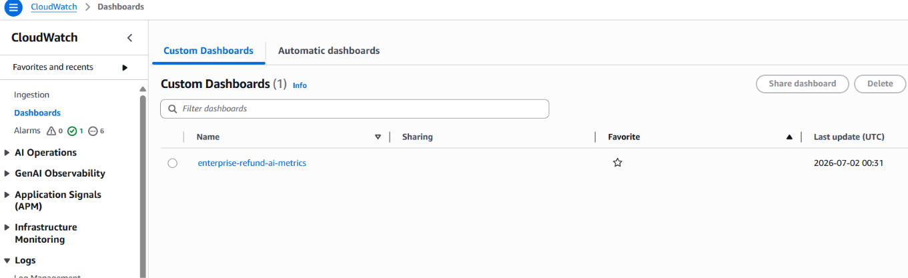

**Figure 17. CloudWatch Dashboard **

---

## CloudWatch Alarms

Operational alarms monitor critical resources and notify administrators of abnormal behavior.

Typical alarm conditions include:

- Lambda failures
- High error rates
- Excessive execution duration
- API Gateway errors

---

## Amazon SNS Notifications

CloudWatch Alarms integrate with Amazon SNS to deliver operational notifications for significant events, enabling rapid awareness and response.

---

## Observability Benefits

The monitoring solution provides:

- Centralized operational visibility
- Faster troubleshooting
- Improved reliability
- Early issue detection
- Historical performance analysis

---

# 12. Security

Security was incorporated into every layer of the platform, following AWS Well-Architected Framework principles and the principle of least privilege.

---

## Identity & Access Management

AWS Identity and Access Management (IAM) controls access between AWS services.

Dedicated IAM roles are assigned to:

- Ask Lambda
- Ingest Lambda
- Admin Lambda
- GitHub Actions deployment pipeline

Each role is granted only the permissions required to perform its specific responsibilities.

---

## GitHub OIDC Authentication

Infrastructure deployments use GitHub OpenID Connect (OIDC) federation instead of long-lived AWS access keys.

Benefits include:

- No static AWS credentials
- Short-lived security tokens
- Improved credential management
- Alignment with AWS security best practices


**Figure 18. GitHub Actions infrastructure deployment pipeline *

---

## Encryption

AWS Key Management Service (KMS) is used to protect sensitive resources through encryption at rest.

Encrypted resources include:

- Amazon S3
- DynamoDB
- Other supported AWS services

---

## API Security

Amazon API Gateway exposes HTTPS endpoints that securely route requests to AWS Lambda.

Authentication and authorization policies can be extended to integrate with enterprise identity providers such as Amazon Cognito or external OAuth providers.

---

## Least-Privilege Design

Every AWS service communicates through narrowly scoped IAM policies.

This minimizes the attack surface while reducing the potential impact of credential misuse.

---

## Secure Infrastructure Deployment

Infrastructure changes are managed exclusively through Terraform and GitHub Actions, providing:

- Version-controlled infrastructure
- Change traceability
- Automated validation
- Repeatable deployments

---

# 13. Project Evolution

The Enterprise Refund AI Assistant was developed incrementally through four major implementation milestones. This phased approach reflects enterprise software delivery practices, where functionality is introduced progressively while maintaining a deployable and testable system at each stage.

| Milestone | Major Deliverables | Outcome |
|-----------|--------------------|---------|
| Milestone 1 – Core Infrastructure | Provisioned foundational AWS services including Amazon S3, AWS Lambda, API Gateway, CloudFront, IAM, DynamoDB, CloudWatch, and Terraform modules. Established secure GitHub Actions CI/CD with OpenID Connect (OIDC). | Created a secure, repeatable cloud foundation and automated deployment pipeline. |
| Milestone 2 – Document Ingestion Pipeline | Implemented event-driven document ingestion using Amazon S3 Event Notifications, Ingest Lambda, PDF text extraction, intelligent chunking (1,000 characters with 200-character overlap), and metadata persistence. | Automated transformation of uploaded enterprise documents into searchable knowledge assets. |
| Milestone 3 – Retrieval-Augmented Generation (RAG) | Introduced semantic retrieval logic, context assembly, and integration between document chunks and the Ask Lambda to enable grounded AI responses. | Transitioned from a traditional chatbot to a document-aware RAG assistant. |
| Milestone 4 – Vector Search & Enterprise AI | Integrated Titan Text Embeddings V2, Amazon OpenSearch Serverless vector indexing, Amazon Nova Lite, automated OpenSearch bootstrap, and end-to-end semantic search. Added operational monitoring, validation, and production-ready deployment refinements. | Delivered a fully operational enterprise-grade RAG platform capable of semantic search and grounded response generation. |

---

## Engineering Journey

Throughout the project, the platform evolved from a foundational AWS deployment into a production-style AI application. Each milestone introduced new capabilities while reinforcing architectural principles such as serverless design, event-driven processing, Infrastructure as Code, and secure automation.

This iterative development approach enabled continuous validation, troubleshooting, and refinement, resulting in a platform that demonstrates not only functional AI capabilities but also the engineering practices required to build, deploy, and operate enterprise cloud solutions.

---

# 14. Engineering Challenges & Solutions

Developing an enterprise-grade AI platform involved addressing a series of architectural, operational, and deployment challenges. Rather than viewing these issues as obstacles, they became opportunities to improve the platform's reliability, maintainability, and production readiness.

The following highlights several key challenges encountered during implementation and the engineering decisions used to resolve them.

---

## Challenge 1 – Secure CI/CD Authentication

### Problem

Traditional CI/CD pipelines often rely on long-lived AWS access keys stored as repository secrets, increasing operational risk and credential management overhead.

### Solution

The deployment pipeline was redesigned to use GitHub OpenID Connect (OIDC) federation. GitHub Actions now authenticates directly with AWS using short-lived credentials, eliminating the need to store static access keys.

### Outcome

- Improved security posture
- Reduced credential management
- Alignment with AWS security best practices

---

## Challenge 2 – OpenSearch Bootstrap Dependencies

### Problem

The OpenSearch bootstrap script initially attempted to install Python dependencies dynamically at runtime, introducing deployment complexity and reducing determinism.

### Solution

Bootstrap dependencies were moved into a dedicated requirements file and installed as part of the GitHub Actions workflow before Terraform executed the bootstrap process.

### Outcome

- Deterministic deployments
- Simplified bootstrap logic
- Improved CI/CD reliability

---

## Challenge 3 – OpenSearch Collection Configuration

### Problem

The bootstrap process originally referenced a hardcoded collection name that differed from the value provisioned by Terraform, preventing successful initialization.

### Solution

The collection name was passed from Terraform to the bootstrap script through environment variables, ensuring both infrastructure and application components referenced the same configuration.

### Outcome

- Eliminated configuration drift
- Improved deployment consistency
- Simplified environment management

---

## Challenge 4 – Access Control for Vector Index Operations

### Problem

Terraform successfully provisioned the OpenSearch collection, but the bootstrap process received authorization errors when attempting to create or validate the vector index.

### Solution

The OpenSearch Serverless data access policy was updated to include the IAM principal executing the Terraform deployment, in addition to the Lambda execution roles.

### Outcome

- Successful bootstrap execution
- Correct IAM authorization
- Secure least-privilege access

---

## Challenge 5 – Vector Index Schema Validation

### Problem

A previously created vector index contained an incompatible schema that no longer matched the expected embedding configuration.

### Solution

Index validation logic was enhanced to verify the expected vector field configuration before use. In development environments, controlled index recreation was introduced behind explicit safety gates, while production environments fail safely and require manual intervention.

### Outcome

- Protected production data
- Improved deployment resilience
- Controlled handling of schema evolution

---

## Challenge 6 – Foundation Model Lifecycle Management

### Problem

During development, the originally selected Bedrock model reached end-of-life, causing inference requests to fail.

### Solution

The model configuration was externalized through Terraform variables, allowing the application to migrate to Amazon Nova Lite without modifying the application logic.

### Outcome

- Simplified model upgrades
- Reduced operational disruption
- Improved configuration management

---

## Challenge 7 – CI/CD and Terraform State Management

### Problem

Infrastructure updates occasionally required reconciliation between local development branches, GitHub Actions workflows, and Terraform state.

### Solution

A disciplined Git workflow, incremental Terraform validation, and automated deployment pipeline were used to maintain infrastructure consistency across environments.

### Outcome

- Reliable deployments
- Improved collaboration
- Consistent infrastructure state

---

## Key Engineering Takeaways

The implementation reinforced several important engineering principles:

- Automate infrastructure wherever possible.
- Keep configuration external to application code.
- Favor managed services to reduce operational complexity.
- Validate infrastructure continuously through automated pipelines.
- Design deployment processes to be repeatable and deterministic.


# 15. Lessons Learned

This project provided practical experience in designing, deploying, and operating an enterprise Retrieval-Augmented Generation (RAG) platform on AWS.

Several key lessons emerged throughout the implementation.

---

## Retrieval-Augmented Generation Improves Reliability

Large language models become significantly more useful when responses are grounded in enterprise knowledge rather than relying exclusively on pretrained information.

Semantic retrieval dramatically reduces hallucinations while improving answer consistency.

---

## Infrastructure as Code Enables Repeatability

Terraform simplified infrastructure management by making every deployment reproducible and version controlled.

Infrastructure became easier to review, modify, and recover.

---

## Serverless Simplifies Operations

Using AWS managed services eliminated infrastructure maintenance while providing automatic scaling and pay-per-use pricing.

This allowed development efforts to focus on application functionality rather than server administration.

---

## Security Should Be Designed In

Implementing GitHub OIDC authentication, IAM least-privilege policies, and AWS KMS encryption from the beginning resulted in a more secure deployment pipeline without adding significant operational overhead.

---

## Monitoring Is Essential

Observability proved just as important as application functionality.

CloudWatch dashboards, logs, and alarms enabled rapid troubleshooting throughout development and deployment.

---

## Enterprise AI Requires More Than a Language Model

Building a production AI platform involves much more than invoking a foundation model.

Success depends on integrating knowledge retrieval, vector databases, Infrastructure as Code, deployment automation, monitoring, and secure operational practices into a cohesive architecture.

---

# 16. Future Enhancements

Although the current platform demonstrates a complete enterprise Retrieval-Augmented Generation solution, several enhancements could further extend its capabilities.

## Planned Enhancements

### Hybrid Search

Combine semantic vector search with traditional keyword search to improve retrieval accuracy for structured documents.

---

### Metadata Filtering

Support filtering by:

- Department
- Document type
- Policy version
- Effective date
- Business unit

---

### Authentication & Authorization

Integrate Amazon Cognito to provide authenticated user access, role-based permissions, and personalized conversations.

---

### Streaming Responses

Support incremental response streaming to improve user experience during longer inference operations.

---

### Administrative Dashboard

Develop a web-based administrative interface for managing documents, monitoring ingestion status, and viewing operational metrics.

---

### Multi-Document Knowledge Bases

Support multiple independent knowledge repositories for different departments or business domains.

---

### Multi-Region Deployment

Deploy across multiple AWS Regions to improve availability and disaster recovery.

---

### Agentic AI Workflows

Extend the platform to support autonomous task orchestration and tool use using emerging agentic AI patterns.

---

### Automated Evaluation

Introduce evaluation pipelines to measure retrieval quality, response accuracy, latency, and overall system performance.

---

# 17. Demonstration

The following resources provide an end-to-end demonstration of the Enterprise Refund AI Assistant.

---

## Source Code

GitHub Repository:

https://github.com/Tijani-Abagaro-GenAI-Cloud/enterprise-refund-ai-showcase

---

## Video Demonstration

A walkthrough video demonstrates:

- Infrastructure deployment
- Document upload
- Automated ingestion
- Semantic vector indexing
- User interaction
- Grounded response generation
- Operational monitoring

LinkedIn:

https://www.linkedin.com/in/tijani-abagaro-7b0975202/

Youtube: comeing soon

---

## Demonstrated Workflow

The complete demonstration validates the following sequence:

1. Upload a policy document to Amazon S3.
2. Trigger the automated ingestion pipeline.
3. Extract and chunk document content.
4. Generate vector embeddings.
5. Index document vectors in Amazon OpenSearch Serverless.
6. Submit a natural language question through the web interface.
7. Perform semantic retrieval.
8. Generate a grounded response using Amazon Nova Lite.
9. Display the response and persist conversation history.

This end-to-end workflow demonstrates the complete lifecycle of enterprise knowledge ingestion and AI-assisted retrieval.

---

# 18. Conclusion

The Enterprise Refund AI Assistant demonstrates how modern cloud-native AI architectures can transform enterprise knowledge into a strategic business asset. Rather than requiring employees or customer service representatives to manually search through complex policy documents, the platform enables natural-language interactions that deliver fast, accurate, and context-aware responses grounded in approved organizational documentation.

By combining Amazon Bedrock, Amazon OpenSearch Serverless, AWS Lambda, Amazon API Gateway, Amazon S3, Amazon DynamoDB, CloudFront, and Terraform, the solution illustrates how organizations can build scalable, secure, and cost-effective Retrieval-Augmented Generation (RAG) platforms that improve operational efficiency while reducing the risk of AI hallucinations through grounded retrieval.

Beyond the technical implementation, this project demonstrates enterprise architecture principles including serverless design, Infrastructure as Code, event-driven processing, secure CI/CD with GitHub OIDC, least-privilege security, automated monitoring, and repeatable deployments. These engineering practices enable organizations to accelerate AI adoption while maintaining operational resilience, governance, and long-term maintainability.

More importantly, this architectural pattern extends far beyond refund policies. The same foundation can be applied to HR knowledge bases, legal and compliance documentation, healthcare procedures, financial regulations, technical support, IT operations, and enterprise knowledge management—allowing organizations to unlock the value of their institutional knowledge through trusted, AI-powered conversational experiences.

Ultimately, this project represents more than the implementation of a Generative AI application. It demonstrates how enterprise architecture, cloud engineering, and responsible AI can be combined to solve real business challenges, improve decision-making, enhance workforce productivity, and establish a scalable foundation for the next generation of intelligent enterprise applications.

---

## Acknowledgements

This project leverages a number of AWS managed services and open technologies that made its implementation possible.

Special thanks to:

- Amazon Web Services (AWS)
- Amazon Bedrock
- Amazon OpenSearch Serverless
- AWS Lambda
- Amazon S3
- Amazon API Gateway
- Amazon CloudFront
- Amazon DynamoDB
- Amazon CloudWatch
- Terraform by HashiCorp
- GitHub Actions
- Python OpenSearch Client
- Boto3 AWS SDK

---

## Skills Demonstrated

This project demonstrates practical experience across multiple domains relevant to enterprise cloud and AI engineering.

### Cloud Architecture

- AWS Solution Architecture
- Serverless Architecture
- Event-Driven Design
- Infrastructure as Code (Terraform)

### Generative AI

- Retrieval-Augmented Generation (RAG)
- Semantic Vector Search
- Amazon Bedrock
- Titan Text Embeddings V2
- Amazon Nova Lite

### Cloud Engineering

- AWS Lambda
- API Gateway
- Amazon S3
- OpenSearch Serverless
- DynamoDB
- CloudFront

### DevOps

- GitHub Actions
- OpenID Connect (OIDC)
- CI/CD Automation
- Infrastructure Validation
- Deployment Automation

### Security

- IAM Least Privilege
- AWS KMS
- Secure CI/CD
- Encryption
- Access Control

### Operations

- CloudWatch Monitoring
- Logging
- Operational Dashboards
- SNS Notifications
- Troubleshooting
- Production Readiness

---
## Author

**Tijani Abagaro**

**Principal AWS & AI Solutions Architect**  
**AWS Certified Solutions Architect Professional**

### Specializations

- Enterprise Cloud Architecture
- Generative AI & RAG
- Amazon Bedrock
- AWS Serverless Architecture
- Terraform & Infrastructure as Code
- DevSecOps & CI/CD

**GitHub:** https://github.com/Tijani-Abagaro-GenAI-Cloud/enterprise-refund-ai-showcase

**LinkedIn:** https://www.linkedin.com/in/tijani-abagaro-7b0975202/

**Badges:** https://www.credly.com/users/tijani-abagaro/badges/credly

**YouTube:** coming soon

---

If you found this project helpful, consider giving it a ⭐ on GitHub.
```